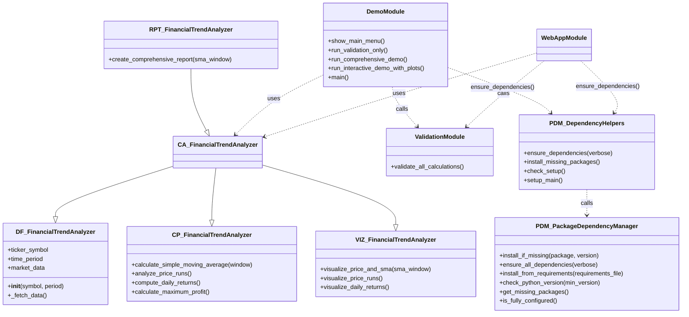

# Stock Market Analysis Tool - Comprehensive Documentation

<!--
This README provides complete documentation for the Stock Market Analysis Tool,
a comprehensive Python application for financial data analysis and visualization.

The tool demonstrates professional software development practices including:
- Modular architecture with separation of concerns
- Comprehensive testing and validation
- User-friendly interfaces (both web and console)
- Automatic dependency management
- Professional documentation and code comments

Group Members: Chanel, Do Tien Son, Marcus, Afiq, Hannah
INF1002 - PROGRAMMING FUNDAMENTALS, LAB-P13-3
-->

## Table of Contents
- [Stock Market Analysis Tool](#stock-market-analysis-tool)
- [Understanding the Results](#understanding-the-results)
- [Requirements](#requirements)
- [Getting Started](#getting-started)
   - [Architecture](#architecture)
   - [Quick Start](#quick-start-windows)
   - [How to Use](#how-to-use)
   - [Project Files](#project-files)
   - [Using the Code Programmatically](#using-the-code-programmatically)
   - [Troubleshooting](#troubleshooting)
- [Edge Cases and Behavior](#edge-cases-and-behavior)
- [Validation and Testing](#validation-and-testing)
- [Support](#support)

# Stock Market Analysis Tool
A comprehensive web application for analyzing stock market trends and patterns. 

Built with Python and Streamlit, this tool provides professional-grade financial analysis capabilities including:
- **Real-time stock data fetching** from Yahoo Finance
- **Technical analysis** with moving averages and trend indicators
- **Statistical analysis** including volatility and return calculations
- **Advanced algorithms** for maximum profit optimization
- **Interactive visualizations** with professional charts and plots
- **Comprehensive validation** ensuring algorithm correctness

## Understanding the Results
**Stock Analysis Results Explained:**

- **Current Price**: The most recent closing price of the stock
- **Price Range**: The lowest to highest price in your selected time period
- **Moving Average**: A smoothed price trend that reduces noise and shows the underlying trend direction
- **Daily Returns**: The percentage change in stock price from one day to the next
- **Volatility**: A measure of how much the price fluctuates (higher values indicate more risk/opportunity)
- **Maximum Profit**: The best possible profit achievable with optimal buying and selling strategy
- **Runs Analysis**: Consecutive days of price increases or decreases, indicating momentum and trend strength

## Requirements
- **Python**: Version 3.7 or higher (3.10+ recommended for best performance)
- **Dependencies**: Automatically installed via `package/dependency_manager.py`
- **Internet Connection**: Required for downloading stock data from Yahoo Finance
- **Web Browser**: For the Streamlit web application interface

# Getting Started

## Architecture


### Quick Start (Windows)
Double-click `start_stock_analysis.bat` to automatically install dependencies and launch the application.

### Manual Installation
1. Install Python 3.10+ if not already installed
2. Clone or download this project
3. Dependencies will be automatically installed when you run the application

### Running the Application

**Option 1: Console Demo & Validation Tool**
```bash
python demo.py
```

**Option 2: Streamlit Web Application**
```bash
streamlit run webapp.py
```
The app will be available at `http://localhost:8501` in your browser.

**Option 3: Windows Batch File (Recommended for Windows users)**
1. Double-click `start_stock_analysis.bat`
2. Choose option 1 for the web application
3. Choose option 2 for the console demo & validation tool

The batch file automatically installs missing dependencies and provides a user-friendly interface.

## How to Use
### Stock Analysis
1. Enter a stock symbol (like AAPL, GOOGL, MSFT, etc.)
2. Choose your time period from the dropdown
3. Set the moving average window with the slider
4. Click "Analyze Stock" to download data and run analysis
5. Explore the results in the different tabs:
   - **Price Chart**: Shows stock price with moving average (interactive slider)
   - **Statistics**: Basic stock information
   - **Returns**: Daily percentage changes
   - **Profit Analysis**: Maximum profit calculations and trend analysis
   - **Runs Analysis**: Visualizes upward/downward price streaks
   - **Validation Tests**: Demonstrates algorithm correctness with test cases

The moving average slider in the Price Chart tab updates the chart in real-time, so you can experiment with different window sizes.

### Help Page
Click "Help" in the sidebar for detailed instructions and a list of common stock symbols to try.

## Project Files
Here's what each file does in the system:

### Core Analysis Files
- `webapp.py` - **Main web interface** built with Streamlit (includes validation tab and interactive features)
- `combined_analyzer.py` - **Composite analyzer** that combines data fetching, computing, and visualization via multiple inheritance
- `data_fetching.py` - **Data retrieval module** that downloads historical market data from Yahoo Finance
- `computing.py` - **Financial calculations** including SMA, runs analysis, returns, and maximum profit algorithms
- `visualizations.py` - **Plotting utilities** for creating professional charts and visualizations
- `reporting.py` - **Extended analyzer** with comprehensive reporting capabilities and CLI-style execution

### Testing and Validation
- `validation.py` - **Comprehensive validation tests** (`validate_all_calculations`) ensuring algorithm correctness
- `demo.py` - **Interactive demo and validation tool** with comprehensive testing and educational content

### System Management
- `start_stock_analysis.bat` - **Main launcher** with automatic dependency management for Windows users
- `package/dependency_manager.py` - **Automatic package installation** system handling all required dependencies
- `requirements.txt` - **Package specifications** listing all required Python packages with version requirements
- `README.md` - **Complete documentation** file with usage instructions and technical details

### Package Structure
- `package/__init__.py` - **Package initialization** making the dependency management system importable

## Using the Code Programmatically

If you want to use the analysis functions in your own code:

```python
from reporting import FinancialTrendAnalyzer

# Create analyzer instance
analyzer = FinancialTrendAnalyzer("AAPL", "1y")

# Get analysis results
sma = analyzer.calculate_simple_moving_average(20)
returns = analyzer.compute_daily_returns()
runs = analyzer.analyze_price_runs()
max_profit, transactions = analyzer.calculate_maximum_profit()

# Generate plots
analyzer.visualize_price_and_sma(20)
analyzer.visualize_price_runs()
analyzer.visualize_daily_returns()

# Generate comprehensive report
analyzer.create_comprehensive_report()

# Run validation tests
from validation import validate_all_calculations
validate_all_calculations()
```


## Troubleshooting
**"Module not found" error:**
Run `pip install -r requirements.txt`

**"No data found" error:**
Check if the stock symbol is correct. Try popular symbols like AAPL, GOOGL, MSFT.

**Web app won't start:**
Make sure you're in the correct directory and run `streamlit run webapp.py`

## Edge Cases and Behavior

The `FinancialTrendAnalyzer` class handles several edge cases gracefully:

### SMA Window > Dataset Length
- **Behavior**: Raises `ValueError` with message "Window size cannot be larger than data length"
- **Example**: If you have 10 days of data and request a 20-day SMA, the system will raise an error
- **Rationale**: Prevents invalid calculations and provides clear error messaging

### Missing/NaN Values
- **Behavior**: The system uses pandas' built-in methods which automatically handle NaN values
- **SMA**: NaN values are excluded from rolling calculations
- **Runs Analysis**: NaN values are treated as zero changes (no direction)
- **Daily Returns**: NaN values are preserved in the output series

### Insufficient Data
- **Max Profit**: Returns (0.0, []) for datasets with less than 2 days
- **Daily Returns**: First value will be NaN (no previous day to compare)
- **Runs Analysis**: Returns empty lists for insufficient data

## Validation and Testing

The project includes comprehensive validation to ensure all calculations are working correctly:

### Web Application Validation
The webapp includes a **Validation Tests** tab that runs all validation tests with a single click:
- **Interactive Interface**: Click "Run All Validation Tests" to execute all tests
- **Real-time Results**: See validation results formatted in a code block
- **Persistent Results**: Results stay visible until manually cleared

### Command Line Demo & Validation
Run the standalone demo & validation tool:
```bash
python demo.py
```

### Validation Test Coverage
Both interfaces run the same comprehensive tests:
- **Test 1**: SMA validation against pandas reference
- **Test 2**: Daily returns validation against pandas pct_change()
- **Test 3**: Runs analysis validation with real stock data
- **Test 4**: Synthetic data validation with known expected results
- **Test 5**: Max profit algorithm validation with simple test case
- **Test 6**: Edge case validation (error handling)

The validation includes synthetic data tests with known expected results to ensure algorithm correctness. All tests compare our implementations against trusted references like pandas.

## Support
If you run into issues:
1. Check the Help page in the web app
2. Look at the error messages carefully
3. Make sure all dependencies are installed
4. Try different stock symbols

---